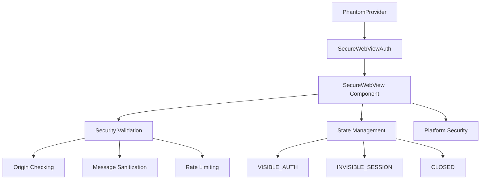

# SecureWebView Implementation Summary

## What We Built

### @phantom/secure-webview Package
- **Secure WebView Component**: Transitions between visible and invisible states
- **Built on react-native-webview** with comprehensive security hardening
- **State Management System**: `CLOSED → VISIBLE_AUTH → INVISIBLE_SESSION`
- **Security Validation Layer**: Origin checking, message sanitization, and rate limiting
- **Platform-specific Security**: Enhanced protections for iOS and Android

### React Native SDK Integration
- **Single `SecureWebViewAuth` Class**: Directly implements the `AuthProvider` interface
- **Clean Integration**: Uses render callbacks with PhantomProvider
- **Automatic Lifecycle Management**: Show for auth, hide after completion
- **Promise-based Authentication**: Proper error handling and cleanup

## Security Analysis: SecureWebView vs Expo WebBrowser

| Aspect | Expo WebBrowser | Our SecureWebView | Security Improvement |
|--------|----------------|-------------------|---------------------|
| **Control** | System browser/Safari View | In-app WebView | ✅ **Full application control** |
| **Visibility** | Always visible, separate UI | Invisible after auth | ✅ **Hidden session persistence** |
| **Origin Validation** | None | Strict allowlist | ✅ **Prevents navigation attacks** |
| **Message Filtering** | None | Rate limiting + sanitization | ✅ **Prevents XSS/injection** |
| **CSP Enforcement** | Browser-dependent | Injected strict CSP | ✅ **Additional content protection** |
| **API Blocking** | None | Configurable dangerous API blocking | ✅ **Reduces attack surface** |
| **Session Isolation** | Shared with system browser | Isolated incognito mode | ✅ **No data leakage** |
| **Storage Access** | Full browser storage | Disabled (DOM/localStorage blocked) | ✅ **No persistent data access** |
| **Network Control** | System network stack | App network with validation | ✅ **Traffic monitoring possible** |

## What We Control

### 🔒 Security Controls

1. **Navigation Security**: Only allow navigation to pre-approved origins
2. **Content Security**: Inject and enforce strict Content Security Policy
3. **API Restrictions**: Block dangerous JavaScript APIs (eval, setTimeout, storage APIs, geolocation, camera/mic)
4. **Message Validation**: Sanitize and rate-limit all incoming messages
5. **Session Isolation**: Force incognito mode, disable caching and storage

### ⚙️ WebView Configuration

```javascript
{
  javaScriptEnabled: true,           // Required for auth flow
  domStorageEnabled: false,          // 🔒 Block localStorage/sessionStorage
  cacheEnabled: false,               // 🔒 No persistent cache
  incognito: true,                   // 🔒 Private browsing mode
  allowsInlineMediaPlaybook: false,  // 🔒 Block media
  allowsProtectedMedia: false,       // 🔒 Block DRM content
  allowFileAccess: false,            // 🔒 Block file system access
  geolocationEnabled: false          // 🔒 Block location access
}
```

### 🛡️ Runtime Security

- **Origin Enforcement**: Block navigation to unauthorized domains
- **Injection Protection**: Sanitize all user inputs and messages
- **Rate Limiting**: Prevent message flooding attacks (100 messages/minute)
- **State Management**: Control exactly when WebView is visible vs invisible
- **Timeout Protection**: Automatic cleanup of stale auth sessions (5 minute timeout)

## Key Advantages

### ✅ Security Benefits
1. **Invisible Persistence**: WebView stays loaded but hidden, enabling future transaction signing without re-auth
2. **Attack Surface Reduction**: Disabled storage, media, file access, and dangerous APIs
3. **Network Isolation**: All traffic goes through the app's network stack
4. **Audit Trail**: Complete logging of navigation and security violations
5. **Flexible Security**: Configurable security policies per deployment environment

### ✅ User Experience
- **Seamless Transactions**: No re-authentication needed for subsequent operations
- **Faster Response**: WebView already loaded and ready
- **Consistent UI**: Stays within the app ecosystem

## Trade-offs

### ✅ Pros
- **Complete Control** over the authentication environment
- **Hidden Session Persistence** for better UX
- **Comprehensive Security** hardening and monitoring
- **Detailed Logging** of all security events
- **Configurable Policies** for different environments

### ⚠️ Cons
- **Larger Bundle Size**: Includes WebView component (~677 KB added)
- **More Complex**: Implementation vs simple system browser redirect
- **Security Configuration**: Requires careful setup and maintenance
- **Platform Differences**: iOS/Android WebView behavior variations

## Architecture Overview



## Conclusion

The **SecureWebView approach** provides **complete control** over the authentication environment with **superior security** compared to system browsers. While it introduces additional complexity, the security benefits and improved user experience (invisible session persistence) make it a significant upgrade over the previous Expo WebBrowser implementation.

**Key Result**: We now have a **security-hardened**, **controllable**, and **persistent** authentication solution that reduces attack surface while improving user experience.